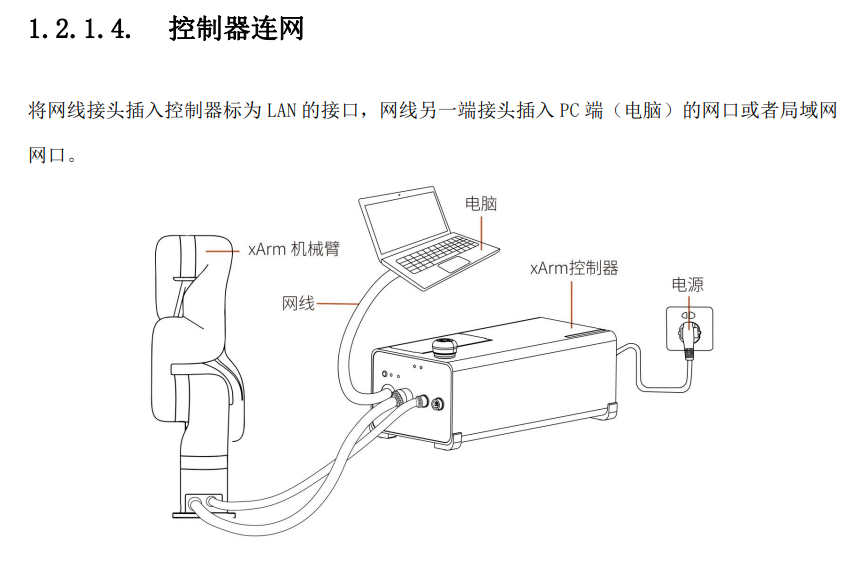
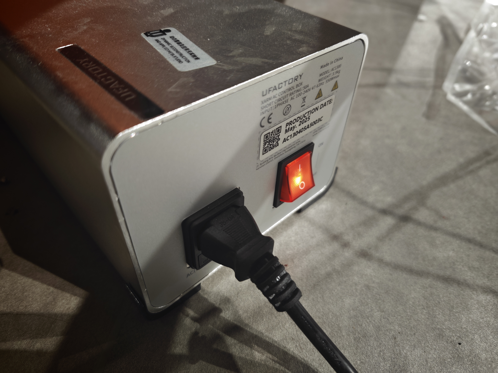
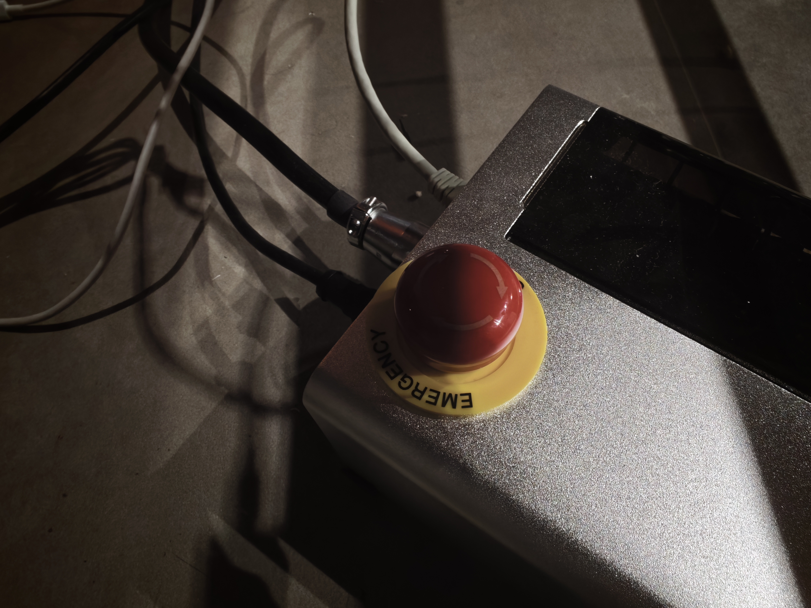
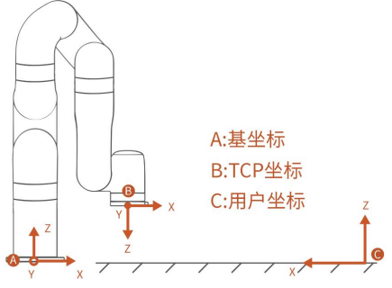
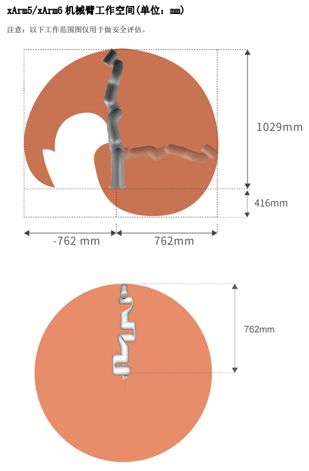

# 1. Reference
https://www.cn.ufactory.cc/xarm-download

https://www.cn.ufactory.cc/_files/ugd/896670_0d6fce6088dd4e52bbd2b988f8ae4d50.pdf

https://www.ufactory.cc/wp-content/uploads/2023/05/xArm-User-Manual-V2.0.0.pdf

# 2. Hardware Supplement(直流电版)
直流电版本,需要额外购买
## 2.1 电源转换器 

`tb link`: 【淘宝】7天无理由退货 https://e.tb.cn/h.6lX75eaYhouzvGc?tk=zFzbV3xND3P CZ007 「明伟开关电源24VNES/S-350w500-24V15A变压器220转12伏5直流48V36」
点击链接直接打开 或者 淘宝搜索直接打开
option: `S-500-24 24V 20.8A`

## 2.2 电源线

`tb link`: 导线 【淘宝】假一赔四 https://e.tb.cn/h.6k9gjbKl4q19jTY?tk=G9nMVWUqy1J CZ356 「RV线电子排多股软铜芯电线黄绿接地线桥架接地线光伏电源信号线」
点击链接直接打开 或者 淘宝搜索直接打开

option: `RV 2.5`

## 2.3 导线

`tb link`: 导线 【淘宝】假一赔四 https://e.tb.cn/h.6k9gjbKl4q19jTY?tk=G9nMVWUqy1J CZ356 「RV线电子排多股软铜芯电线黄绿接地线桥架接地线光伏电源信号线」
点击链接直接打开 或者 淘宝搜索直接打开

option: `国标1.0平方 1.5m`

## 2.4 Hardware connection
### 2.4.1 电源插头与电源转换器

| 电源插头     | 控制器    |
|----------|-----------|
| 红色 +V  | VP+       |
| 黑色 -V  | GND       |
| GND      | PE        |
### 2.4.2 controller with arm

### 2.4.3 emergency stop

急停这里要把它原先的端子用力拔出(左图),而后再把急停端子用力插入

### 2.4.4 arm base

# 3. Hardware connection (交流电版)

## 3.1 switch button

## 3.2 emergency stop button

# 4. network connection
此外，用网线连接控制器和电脑

## 4.1 Network Connection
在控制箱上有机械臂的`ip地址`

## 4.2 PC network connection configuration
根据机械臂ip地址，将PC ip地址进行设置

name: `xarm`

IPv4: `192.168.1.220` (在`192.168.1.x`网段下即可, 设置的ip不要是0, 255和与机械臂ip相同) 

子网掩码: `255.255.255.0`

# 5. start arm
press the button, and it will turn to red

# 6. Frame and workspace

# 7. models
xarm mount and xarm 7 urdf all in models dirtectory