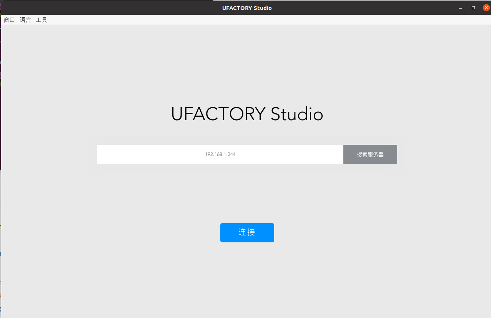
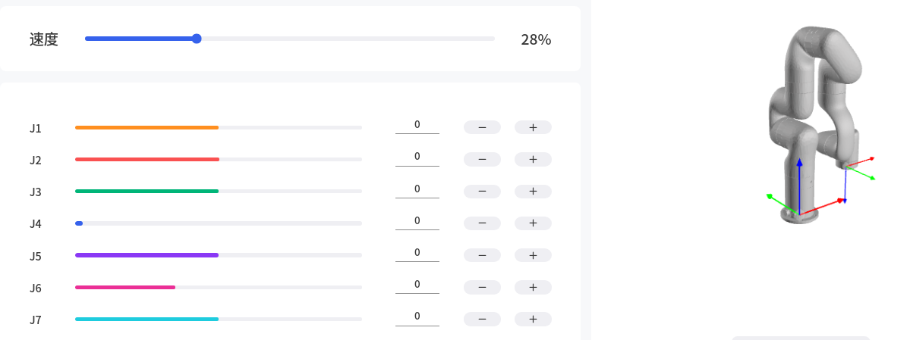
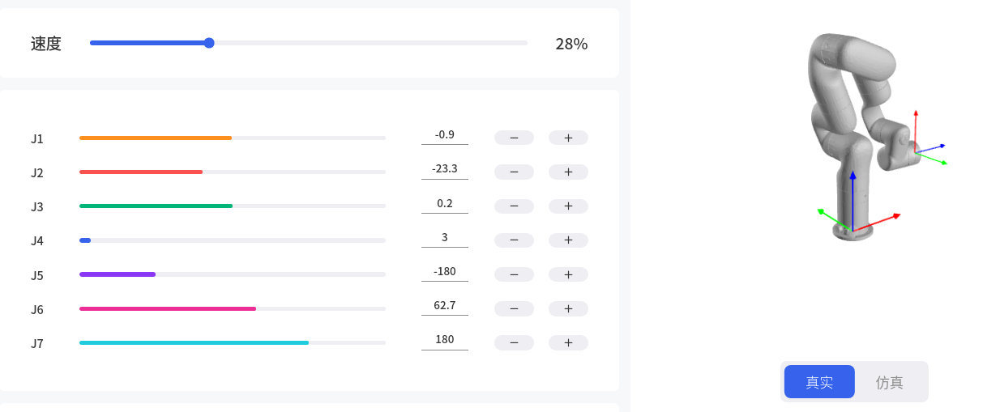
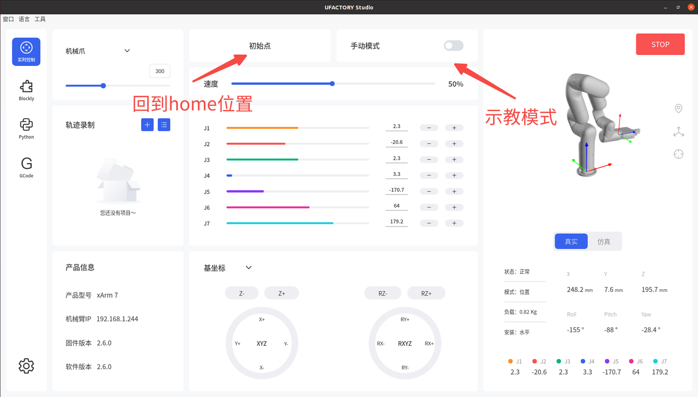
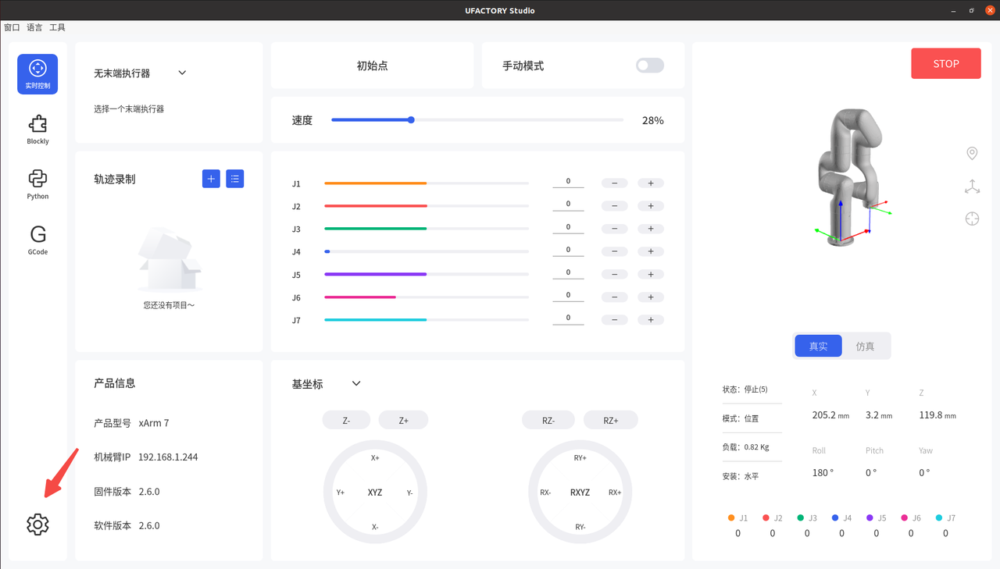
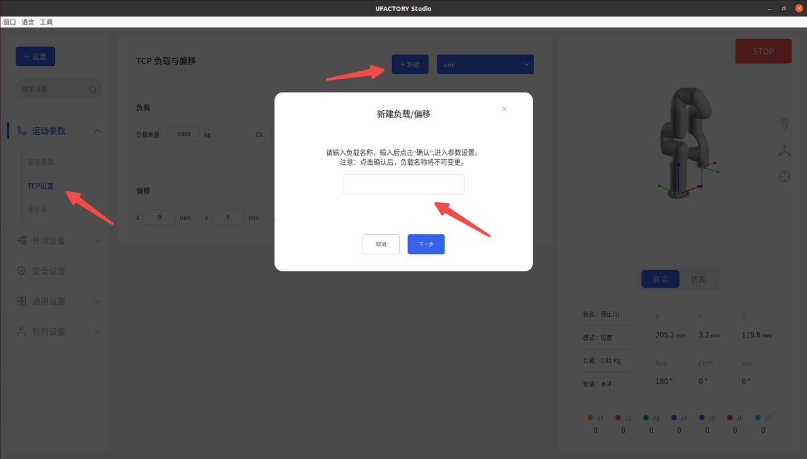

# Desktop
## linux
# 1. start the app
```
./ufactory-studio-client-linux-1.0.2.AppImage 
```
output
```
System Locale: 
Failed to read / on app protocol Error: Invalid package /tmp/.mount_ufactoLSE9tX/resources/app.asar/
    at createError (electron/js2c/asar_bundle.js:5:1585)
    at fsReadFileAsar (electron/js2c/asar_bundle.js:5:7370)
    at e.readFile (electron/js2c/asar_bundle.js:5:8550)
    at Function.<anonymous> (/tmp/.mount_ufactoLSE9tX/resources/app.asar/background.js:2:1076989)
```
ubuntu 22.04 bug，运行报错
```
dlopen(): error loading libfuse.so.2

AppImages require FUSE to run. 
You might still be able to extract the contents of this AppImage 
if you run it with the --appimage-extract option. 
See https://github.com/AppImage/AppImageKit/wiki/FUSE
```
solution
```
sudo apt update
sudo apt install fuse libfuse2
```
output
```
命中:1 http://mirrors.ustc.edu.cn/ubuntu jammy InRelease
获取:2 http://mirrors.ustc.edu.cn/ubuntu jammy-updates InRelease [128 kB]
获取:3 https://mirrors.ustc.edu.cn/ros2/ubuntu jammy InRelease [4,682 B]
获取:4 http://mirrors.ustc.edu.cn/ubuntu jammy-backports InRelease [127 kB]
获取:5 http://mirrors.ustc.edu.cn/ubuntu jammy-security InRelease [129 kB]
获取:6 http://mirrors.ustc.edu.cn/ubuntu jammy-updates/main amd64 Packages [3,165 kB]
获取:7 http://mirrors.ustc.edu.cn/ubuntu jammy-updates/main i386 Packages [935 kB]
获取:8 http://mirrors.ustc.edu.cn/ubuntu jammy-updates/main Translation-en [485 kB]
获取:9 http://mirrors.ustc.edu.cn/ubuntu jammy-updates/main amd64 DEP-11 Metadata [112 kB]
获取:10 http://mirrors.ustc.edu.cn/ubuntu jammy-updates/main amd64 c-n-f Metadata [19.1 kB]
获取:11 http://mirrors.ustc.edu.cn/ubuntu jammy-updates/restricted amd64 Packages [5,101 kB]
获取:12 http://mirrors.ustc.edu.cn/ubuntu jammy-updates/restricted i386 Packages [50.3 kB]
获取:13 http://mirrors.ustc.edu.cn/ubuntu jammy-updates/restricted Translation-en [957 kB]
获取:14 http://mirrors.ustc.edu.cn/ubuntu jammy-updates/restricted amd64 DEP-11 Metadata [212 B]
获取:15 http://mirrors.ustc.edu.cn/ubuntu jammy-updates/restricted amd64 c-n-f Metadata [632 B]
获取:16 http://mirrors.ustc.edu.cn/ubuntu jammy-updates/universe amd64 Packages [1,248 kB]
获取:17 http://mirrors.ustc.edu.cn/ubuntu jammy-updates/universe i386 Packages [792 kB]
获取:18 http://mirrors.ustc.edu.cn/ubuntu jammy-updates/universe Translation-en [311 kB]
获取:19 http://mirrors.ustc.edu.cn/ubuntu jammy-updates/universe amd64 DEP-11 Metadata [360 kB]
获取:20 http://mirrors.ustc.edu.cn/ubuntu jammy-updates/universe amd64 c-n-f Metadata [30.1 kB]
获取:21 http://mirrors.ustc.edu.cn/ubuntu jammy-updates/multiverse i386 Packages [11.9 kB]
获取:22 http://mirrors.ustc.edu.cn/ubuntu jammy-updates/multiverse amd64 Packages [70.1 kB]
获取:23 http://mirrors.ustc.edu.cn/ubuntu jammy-updates/multiverse Translation-en [15.5 kB]
获取:24 http://mirrors.ustc.edu.cn/ubuntu jammy-updates/multiverse amd64 DEP-11 Metadata [940 B]
获取:25 http://mirrors.ustc.edu.cn/ubuntu jammy-updates/multiverse amd64 c-n-f Metadata [768 B]
获取:26 http://mirrors.ustc.edu.cn/ubuntu jammy-backports/main amd64 DEP-11 Metadata [7,316 B]
获取:27 http://mirrors.ustc.edu.cn/ubuntu jammy-backports/restricted amd64 DEP-11 Metadata [212 B]
获取:28 http://mirrors.ustc.edu.cn/ubuntu jammy-backports/universe amd64 DEP-11 Metadata [10.2 kB]
获取:29 http://mirrors.ustc.edu.cn/ubuntu jammy-backports/multiverse amd64 DEP-11 Metadata [212 B]
获取:30 http://mirrors.ustc.edu.cn/ubuntu jammy-security/main i386 Packages [753 kB]
获取:31 http://mirrors.ustc.edu.cn/ubuntu jammy-security/main amd64 Packages [2,904 kB]
获取:32 http://mirrors.ustc.edu.cn/ubuntu jammy-security/main Translation-en [419 kB]
获取:33 http://mirrors.ustc.edu.cn/ubuntu jammy-security/main amd64 DEP-11 Metadata [54.6 kB]
获取:34 http://mirrors.ustc.edu.cn/ubuntu jammy-security/main amd64 c-n-f Metadata [14.1 kB]
获取:35 http://mirrors.ustc.edu.cn/ubuntu jammy-security/restricted amd64 DEP-11 Metadata [208 B]
获取:36 http://mirrors.ustc.edu.cn/ubuntu jammy-security/universe amd64 Packages [1,011 kB]
获取:37 http://mirrors.ustc.edu.cn/ubuntu jammy-security/universe i386 Packages [681 kB]
获取:38 http://mirrors.ustc.edu.cn/ubuntu jammy-security/universe Translation-en [222 kB]
获取:39 http://mirrors.ustc.edu.cn/ubuntu jammy-security/universe amd64 DEP-11 Metadata [125 kB]
获取:40 http://mirrors.ustc.edu.cn/ubuntu jammy-security/universe amd64 c-n-f Metadata [22.5 kB]
获取:41 http://mirrors.ustc.edu.cn/ubuntu jammy-security/multiverse i386 Packages [5,628 B]
获取:42 http://mirrors.ustc.edu.cn/ubuntu jammy-security/multiverse amd64 Packages [51.1 kB]
获取:43 http://mirrors.ustc.edu.cn/ubuntu jammy-security/multiverse Translation-en [10.5 kB]
获取:44 http://mirrors.ustc.edu.cn/ubuntu jammy-security/multiverse amd64 DEP-11 Metadata [208 B]
已下载 20.3 MB，耗时 4秒 (4,899 kB/s)
正在读取软件包列表... 完成
正在分析软件包的依赖关系树... 完成
正在读取状态信息... 完成                 
有 304 个软件包可以升级。请执行 ‘apt list --upgradable’ 来查看它们。
正在读取软件包列表... 完成
正在分析软件包的依赖关系树... 完成
正在读取状态信息... 完成                 
下列软件包是自动安装的并且现在不需要了：
  apg gnome-control-center-faces gnome-online-accounts libcolord-gtk1
  libfreerdp-server2-2 libgnome-bg-4-1 libgsound0 libgssdp-1.2-0
  libgupnp-1.2-1 libgupnp-av-1.0-3 libgupnp-dlna-2.0-4 libntfs-3g89
  librygel-core-2.6-2 librygel-db-2.6-2 librygel-renderer-2.6-2
  librygel-server-2.6-2 libvncserver1 mobile-broadband-provider-info
  network-manager-gnome python3-certifi python3-macaroonbakery
  python3-protobuf python3-pymacaroons python3-requests python3-rfc3339 rygel
使用'sudo apt autoremove'来卸载它(它们)。
下列软件包将被【卸载】：
  fuse3 gnome-control-center gnome-remote-desktop
  gnome-shell-extension-desktop-icons-ng gvfs-fuse ntfs-3g ubuntu-desktop
  ubuntu-desktop-minimal xdg-desktop-portal xdg-desktop-portal-gnome
  xdg-desktop-portal-gtk
下列【新】软件包将被安装：
  fuse libfuse2
升级了 0 个软件包，新安装了 2 个软件包，要卸载 11 个软件包，有 304 个软件包未被升级。
需要下载 117 kB 的归档。
解压缩后将会空出 9,246 kB 的空间。
您希望继续执行吗？ [Y/n] 
获取:1 http://mirrors.ustc.edu.cn/ubuntu jammy/universe amd64 libfuse2 amd64 2.9.9-5ubuntu3 [90.3 kB]
获取:2 http://mirrors.ustc.edu.cn/ubuntu jammy/universe amd64 fuse amd64 2.9.9-5ubuntu3 [27.0 kB]
已下载 117 kB，耗时 1秒 (109 kB/s)
正在选中未选择的软件包 libfuse2:amd64。
(正在读取数据库 ... 系统当前共安装有 320869 个文件和目录。)
准备解压 .../libfuse2_2.9.9-5ubuntu3_amd64.deb  ...
正在解压 libfuse2:amd64 (2.9.9-5ubuntu3) ...
(正在读取数据库 ... 系统当前共安装有 320881 个文件和目录。)
正在卸载 xdg-desktop-portal-gnome (42.1-0ubuntu2) ...
dpkg: xdg-desktop-portal：有依赖问题，但是如您所愿，将继续卸载：
 xdg-desktop-portal-gtk 依赖于 xdg-desktop-portal (>= 1.14.0).
 gnome-shell-extension-desktop-icons-ng 依赖于 xdg-desktop-portal.

正在卸载 xdg-desktop-portal (1.14.4-1ubuntu2~22.04.2) ...
dpkg: fuse3：有依赖问题，但是如您所愿，将继续卸载：
 snapd 依赖于 fuse3 (>= 3.10.5-1) | fuse；然而：
  即将删除 fuse3。
  未安装软件包 fuse。
  提供了 fuse 的软件包 fuse3 即将被删除。
 ntfs-3g 依赖于 fuse3.
 gvfs-fuse 依赖于 fuse3.
 gnome-remote-desktop 依赖于 fuse3.
 snapd 依赖于 fuse3 (>= 3.10.5-1) | fuse；然而：
  即将删除 fuse3。
  未安装软件包 fuse。
  提供了 fuse 的软件包 fuse3 即将被删除。

正在卸载 fuse3 (3.10.5-1build1) ...
update-initramfs: deferring update (trigger activated)
正在选中未选择的软件包 fuse。
(正在读取数据库 ... 系统当前共安装有 320844 个文件和目录。)
准备解压 .../fuse_2.9.9-5ubuntu3_amd64.deb  ...
正在解压 fuse (2.9.9-5ubuntu3) ...
(正在读取数据库 ... 系统当前共安装有 320854 个文件和目录。)
正在卸载 ubuntu-desktop (1.481.4) ...
正在卸载 ubuntu-desktop-minimal (1.481.4) ...
正在卸载 gnome-control-center (1:41.7-0ubuntu0.22.04.9) ...
正在卸载 gnome-remote-desktop (42.9-0ubuntu0.22.04.2) ...
正在卸载 gnome-shell-extension-desktop-icons-ng (43-2ubuntu1) ...
正在卸载 gvfs-fuse (1.48.2-0ubuntu1) ...
正在卸载 ntfs-3g (1:2021.8.22-3ubuntu1.2) ...
正在卸载 xdg-desktop-portal-gtk (1.14.0-1build1) ...
正在设置 libfuse2:amd64 (2.9.9-5ubuntu3) ...
正在设置 fuse (2.9.9-5ubuntu3) ...
正在安装新版本配置文件 /etc/fuse.conf ...
update-initramfs: deferring update (trigger activated)
正在处理用于 initramfs-tools (0.140ubuntu13.5) 的触发器 ...
update-initramfs: Generating /boot/initrd.img-6.8.0-90-generic
正在处理用于 gnome-menus (3.36.0-1ubuntu3) 的触发器 ...
正在处理用于 libglib2.0-0:amd64 (2.72.4-0ubuntu2.6) 的触发器 ...
正在处理用于 libglib2.0-0:i386 (2.72.4-0ubuntu2.6) 的触发器 ...
正在处理用于 libc-bin (2.35-0ubuntu3.11) 的触发器 ...
正在处理用于 man-db (2.10.2-1) 的触发器 ...
正在处理用于 mailcap (3.70+nmu1ubuntu1) 的触发器 ...
正在处理用于 desktop-file-utils (0.26-1ubuntu3) 的触发器 ...
```
# 2. connect the xarm


> 在服务器中输入对应的机械臂ip地址，如果提示无法连接，请检查
> 1. 网线是否连接
> 2. 地址是否输入正确
> 3. 是否开了梯子

# 3. coordinate system
x: red

y: green

z: blue

## 3.1 home state


## 3.2 initial state


# 4. home and teaching mode


# 5. TCP setup



输入名字后由xarm自动进行重量标定