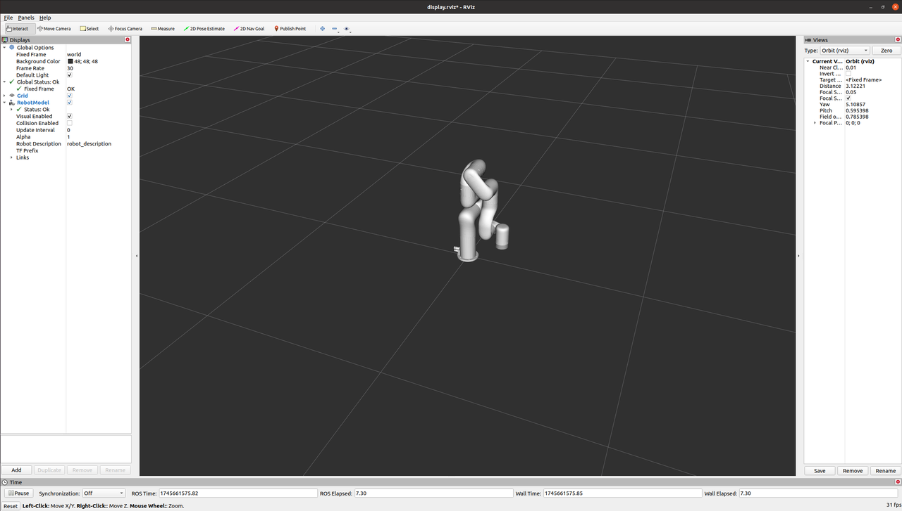

# Github
https://github.com/ChangerC77/xarm_ros

# 1. Install
## 1.1 environment setup
```
pip install empy==3.3.4
pip install defusedxml
```
## 1.2  Obtain the package
```
mkdir -p ~/xarm_ws/src && cd xarm_ws/src
git clone https://github.com/ChangerC77/xarm_ros.git --recursive
```
## 1.3 update the package
```
cd ~/xarm_ws/src/xarm_ros
git pull
git submodule sync
git submodule update --init --remote
```
## 1.4. Install other dependent packages:
```
sudo rosdep init
rosdep update
rosdep check --from-paths . --ignore-src --rosdistro noetic
```
## 1.5. Build the code
```
cd ~/xarm_ws
catkin_make
```
## 1.6. Source the setup script
- zsh
```
echo "source ~/xarm_ws/devel/setup.zsh" >> ~/.zshrc
source ~/.zshrc
```
- bash
```
echo "source ~/xarm_ws/devel/setup.bash" >> ~/.bashrc
source ~/.bashrc
```
# 2. Control
```
roslaunch xarm_bringup xarm7_server.launch robot_ip:=192.168.1.239 report_type:=normal
```
```
rostopic list
```
output
```
/rosout
/rosout_agg
/xarm/controller_gpio_states
/xarm/joint_states
/xarm/sleep_sec
/xarm/uf_ftsensor_ext_states
/xarm/uf_ftsensor_raw_states
/xarm/velo_move_joint_timed
/xarm/velo_move_line_timed
/xarm/xarm_gripper/gripper_action/cancel
/xarm/xarm_gripper/gripper_action/feedback
/xarm/xarm_gripper/gripper_action/goal
/xarm/xarm_gripper/gripper_action/result
/xarm/xarm_gripper/gripper_action/status
/xarm/xarm_states
enable servo motors
rosservice call /xarm/motion_ctrl 8 1
  Before any motion commands, set proper robot mode(0: POSE) and state(0: READY) in order, refer to SetInt16.srv:
```
## 2.1 control mode
```
rosservice call /xarm/set_mode 0
rosservice call /xarm/set_state 0
```
## 2.2 teach mode
```
rosservice call /xarm/set_mode 2
```
```
ret: 0
message: "joint teach, ret = 0"
```
```
rosservice call /xarm/set_state 0
```
```
[0.15110670030117035, -0.6628119945526123, 0.037105076014995575, 0.9320064783096313, -0.030976824462413788, 1.6339387893676758, -0.5622403621673584]
```
```
rosservice call /xarm/move_joint [1,-0.6,0.8,33.3,1.9,36,2.5] 0.35 7 0 0
```
```
rosservice call /xarm/move_line [380,15,200,3.14,0,0] 200 2000 0 0
```
# 2.3 RViz:


```
roslaunch xarm_description xarm7_rviz_display.launch
```
output
```
Checking log directory for disk usage. This may take a while.
Press Ctrl-C to interrupt
Done checking log file disk usage. Usage is <1GB.

xacro: in-order processing became default in ROS Melodic. You can drop the option.
Using load_yaml() directly is deprecated. Use xacro.load_yaml() instead.
Using load_yaml() directly is deprecated. Use xacro.load_yaml() instead.
started roslaunch server http://robotics:44553/

SUMMARY
========

PARAMETERS
 * /joint_state_publisher/source_list: ['/joint_states']
 * /joint_state_publisher/use_gui: True
 * /robot_description: <?xml version="1....
 * /rosdistro: noetic
 * /rosversion: 1.17.0

NODES
  /
    joint_state_publisher (joint_state_publisher/joint_state_publisher)
    robot_state_publisher (robot_state_publisher/robot_state_publisher)
    rviz (rviz/rviz)

auto-starting new master
process[master]: started with pid [10107]
ROS_MASTER_URI=http://localhost:11311

setting /run_id to 236b9eb6-2285-11f0-b4d0-05913f1d0335
process[rosout-1]: started with pid [10139]
started core service [/rosout]
process[joint_state_publisher-2]: started with pid [10142]
process[robot_state_publisher-3]: started with pid [10143]
process[rviz-4]: started with pid [10145]
[INFO] [1745661567.942382253]: rviz version 1.14.25
[INFO] [1745661567.942408729]: compiled against Qt version 5.12.8
[INFO] [1745661567.942436203]: compiled against OGRE version 1.9.0 (Ghadamon)
[INFO] [1745661567.949984580]: Forcing OpenGl version 0.
[INFO] [1745661568.349372506]: Stereo is NOT SUPPORTED
[INFO] [1745661568.349404390]: OpenGL device: NV164
[INFO] [1745661568.349443107]: OpenGl version: 4.3 (GLSL 4.3) limited to GLSL 1.4 on Mesa system.
```

# 2.4 spacemouse control
```
sudo apt-get install ros-${ROS_DISTRO}-moveit-simple-controller-manager
```
```
roslaunch xarm_moveit_servo xarm_moveit_servo_realmove.launch robot_ip:=192.168.1.239 dof:=7 joystick_type:=3
```
# 2.5 keyboard control
```
roslaunch xarm_moveit_servo xarm_moveit_servo_realmove.launch robot_ip:=192.168.1.239 dof:=7 joystick_type:=99
```
output
```
You can start planning now!

[WARN] [1745661672.929650134]: An acceleration limit is not defined for this joint; minimum stop distance should not be used for collision checking
[INFO] [1745661672.984702125]: Stereo is NOT SUPPORTED
[INFO] [1745661672.984738842]: OpenGL device: NV164
[INFO] [1745661672.984753473]: OpenGl version: 4.3 (GLSL 4.3) limited to GLSL 1.4 on Mesa system.
SDK_VERSION: 1.15.1
Tcp control connection successful
ROBOT_IP: 192.168.1.228, VERSION: v2.5.1, PROTOCOL: V1, DETAIL: 6,6,XI1305,DC1303,v2.5.1, TYPE1300: [1, 1]
Tcp Report Rich connection successful
change protocol identifier to 3
report_data_size: 574, size_is_not_confirm: 0
Tcp Report develop connection successful
[INFO] [1745661673.696768476]: [TCP STATUS] CONTROL: 1, REPORT: 1
report_data_size: 135, size_is_not_confirm: 0
[INFO] [1745661673.773663675]: [192.168.1.228] joint1, ctrl_method=0, has_soft_limits=0, has_velocity_limits=1, max_velocity=2.140000, has_position_limits=1, min_position=-3.110177, max_position=3.110177

[INFO] [1745661673.774979729]: [192.168.1.228] joint2, ctrl_method=0, has_soft_limits=0, has_velocity_limits=1, max_velocity=2.140000, has_position_limits=1, min_position=-2.059000, max_position=2.094400

[INFO] [1745661673.776232367]: [192.168.1.228] joint3, ctrl_method=0, has_soft_limits=0, has_velocity_limits=1, max_velocity=2.140000, has_position_limits=1, min_position=-3.110177, max_position=0.191980

[INFO] [1745661673.777413027]: [192.168.1.228] joint4, ctrl_method=0, has_soft_limits=0, has_velocity_limits=1, max_velocity=2.140000, has_position_limits=1, min_position=-3.110177, max_position=3.110177

[INFO] [1745661673.778582746]: [192.168.1.228] joint5, ctrl_method=0, has_soft_limits=0, has_velocity_limits=1, max_velocity=2.140000, has_position_limits=1, min_position=-1.692970, max_position=3.110177

[INFO] [1745661673.779758416]: [192.168.1.228] joint6, ctrl_method=0, has_soft_limits=0, has_velocity_limits=1, max_velocity=2.140000, has_position_limits=1, min_position=-3.110177, max_position=3.110177

[set_state], xArm is ready to move
[INFO] [1745661673.828165242]: waitForService: Service [/xarm/controller_manager/list_controllers] is now available.
[INFO] [1745661673.939384]: Controller Spawner: Waiting for service controller_manager/switch_controller
[INFO] [1745661673.941330]: Controller Spawner: Waiting for service controller_manager/unload_controller
[INFO] [1745661673.943194]: Loading controller: xarm6_traj_controller
[INFO] [1745661673.963846]: Loading controller: joint_state_controller
[INFO] [1745661673.967572]: Controller Spawner: Loaded controllers: xarm6_traj_controller, joint_state_controller
[INFO] [1745661675.821877547]: controller number 1, name: xarm6_traj_controller, state: running
[INFO] [1745661675.821896734]: controller number 2, name: joint_state_controller, state: running
[INFO] [1745661675.821932]: Started controllers: xarm6_traj_controller, joint_state_controller
[INFO] [1745661676.245686048]: Loading robot model 'UF_ROBOT'...
[INFO] [1745661676.245745129]: No root/virtual joint specified in SRDF. Assuming fixed joint
[WARN] [1745661676.305113149]: Kinematics solver doesn't support #attempts anymore, but only a timeout.
Please remove the parameter '/rviz_robotics_10609_3360241936307255463/xarm6/kinematics_solver_attempts' from your configuration.
Reading from keyboard
---------------------------
Use arrow keys and the '.' and ';' keys to Cartesian jog
Use 'W' to Cartesian jog in the world frame, and 'E' for the End-Effector frame
Use 1|2|3|4|5|6|7 keys to joint jog. 'R' to reverse the direction of jogging.
'Q' to quit.
[INFO] [1745661676.467984963]: Starting planning scene monitor
[INFO] [1745661676.469250386]: Listening to '/move_group/monitored_planning_scene'
[INFO] [1745661676.477643722]: No active joints or end effectors found for group 'tool_end'. Make sure that kinematics.yaml is loaded in this node's namespace.
[INFO] [1745661676.478497169]: No active joints or end effectors found for group 'tool_end'. Make sure that kinematics.yaml is loaded in this node's namespace.
[INFO] [1745661676.480670917]: Constructing new MoveGroup connection for group 'tool_end' in namespace ''
[INFO] [1745661677.574586285]: Ready to take commands for planning group tool_end.
```