# xArm-Python-SDK

## Overview
xArm Python SDK

## Caution
- Please keep away from the robot arm to avoid personal injury or equipment damage.
- Make sure to do a safety assessment before moving to prevent collisions.
- Protect the arm before unlocking the joint.

## Hardware Supplement(直流电版)
直流电版本,需要额外购买
### 1. 电源转换器 

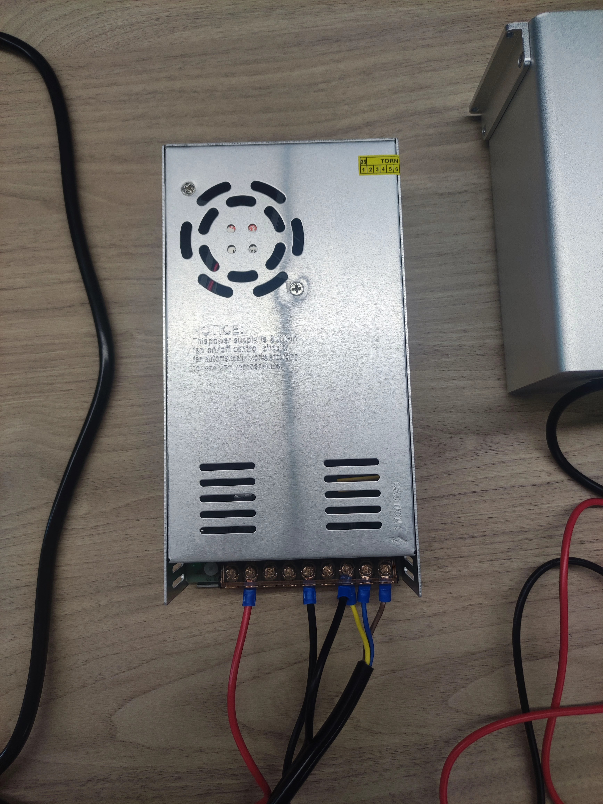

`tb link`: 【淘宝】7天无理由退货 https://e.tb.cn/h.6lX75eaYhouzvGc?tk=zFzbV3xND3P CZ007 「明伟开关电源24VNES/S-350w500-24V15A变压器220转12伏5直流48V36」
点击链接直接打开 或者 淘宝搜索直接打开
option: `S-500-24 24V 20.8A`

### 2. 电源线


`tb link`: 导线 【淘宝】假一赔四 https://e.tb.cn/h.6k9gjbKl4q19jTY?tk=G9nMVWUqy1J CZ356 「RV线电子排多股软铜芯电线黄绿接地线桥架接地线光伏电源信号线」
点击链接直接打开 或者 淘宝搜索直接打开

option: `RV 2.5`

### 3. 导线
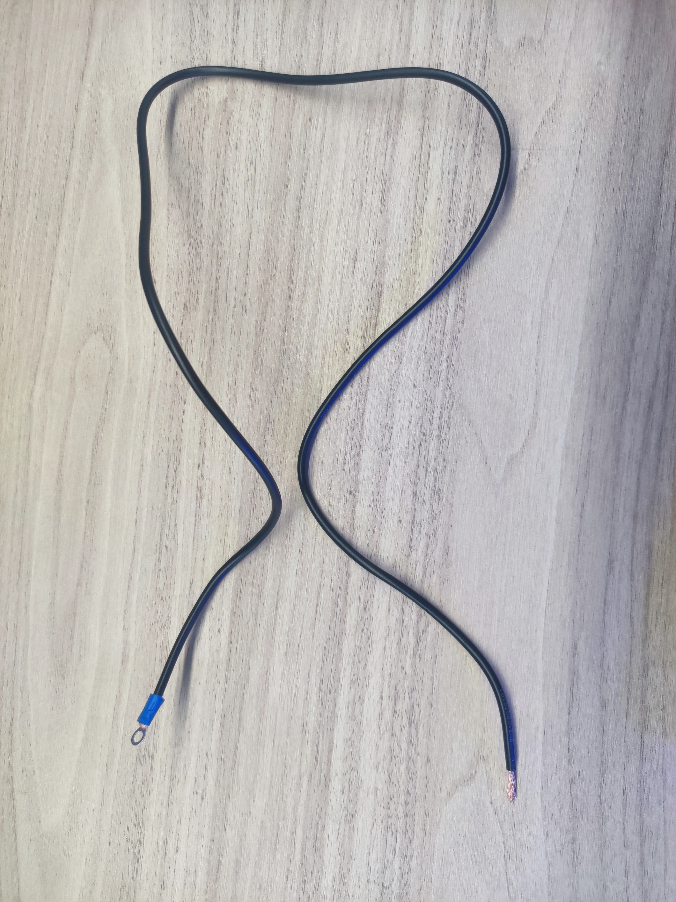

`tb link`: 导线 【淘宝】假一赔四 https://e.tb.cn/h.6k9gjbKl4q19jTY?tk=G9nMVWUqy1J CZ356 「RV线电子排多股软铜芯电线黄绿接地线桥架接地线光伏电源信号线」
点击链接直接打开 或者 淘宝搜索直接打开

option: `国标1.0平方 1.5m`

## Hardware connection
### 电源插头与电源转换器
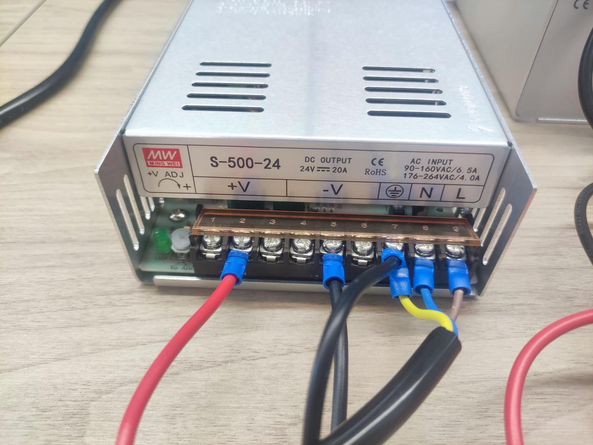
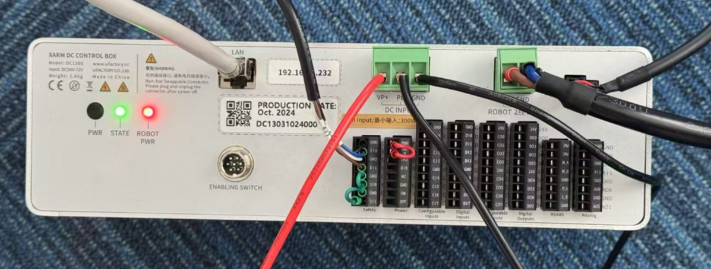
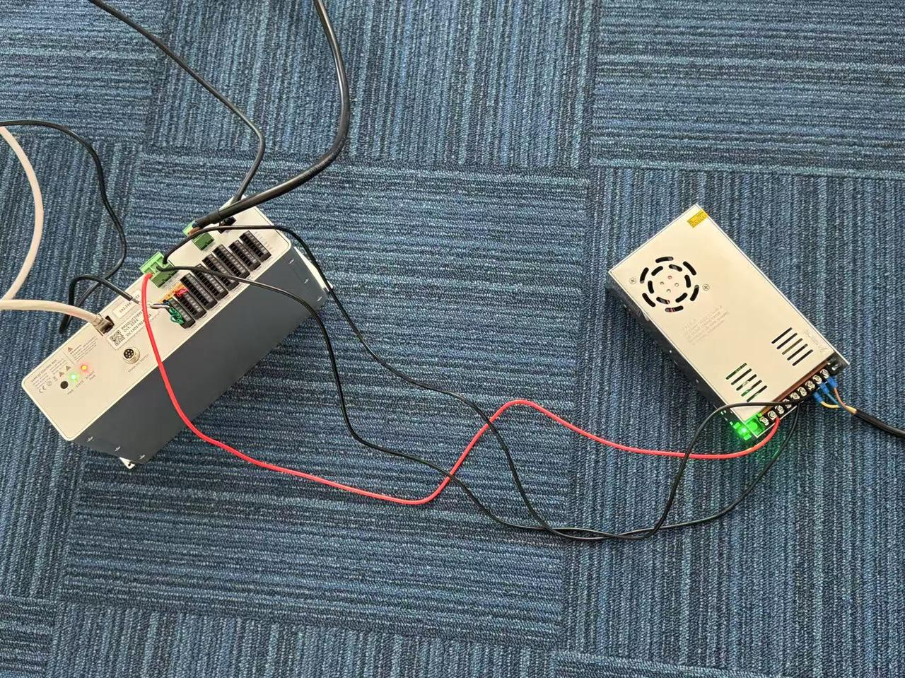

| 电源插头     | 控制器    |
|----------|-----------|
| 红色 +V  | VP+       |
| 黑色 -V  | GND       |
| GND      | PE        |
### controller with arm
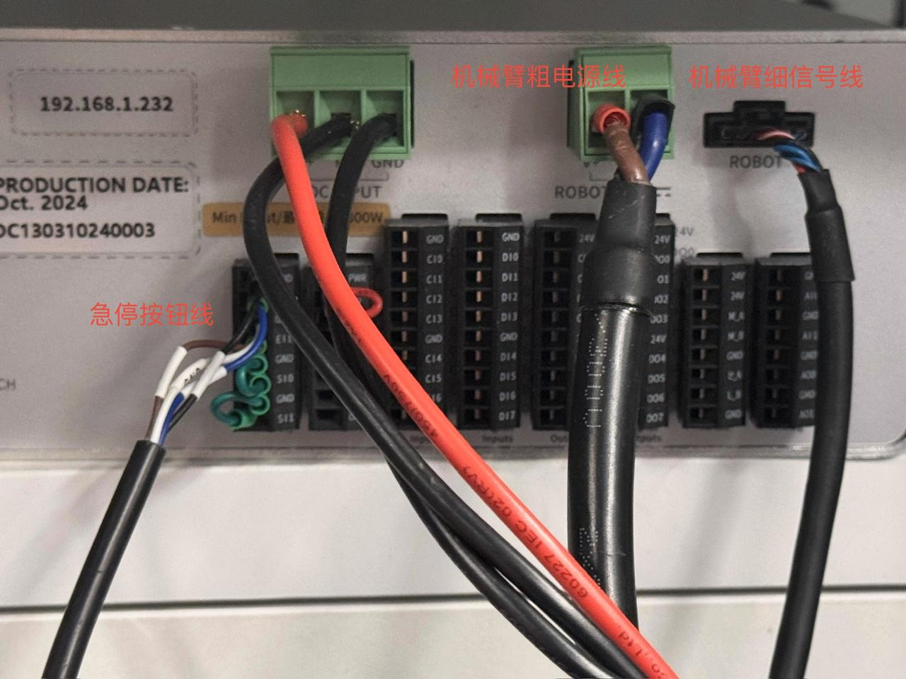

### emergency stop

急停这里要把它原先的端子用力拔出(左图),而后再把急停端子用力插入
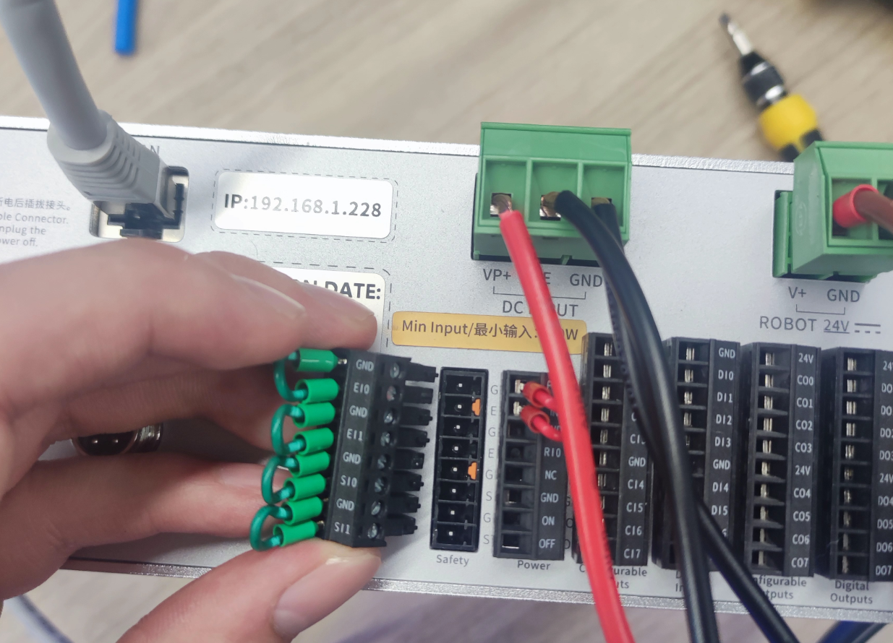
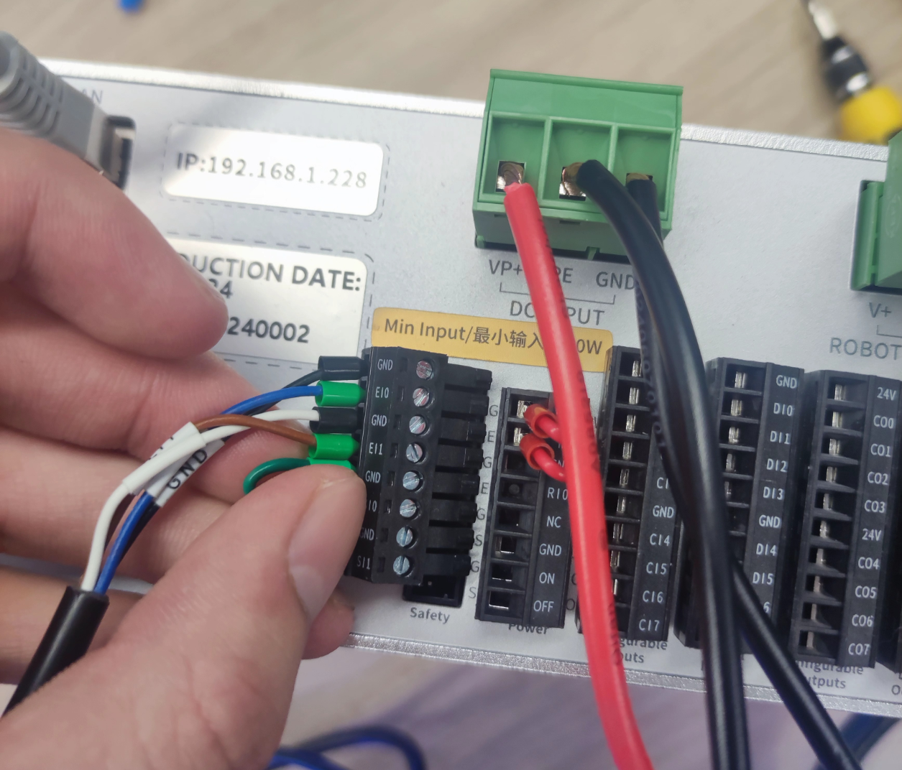


### arm base
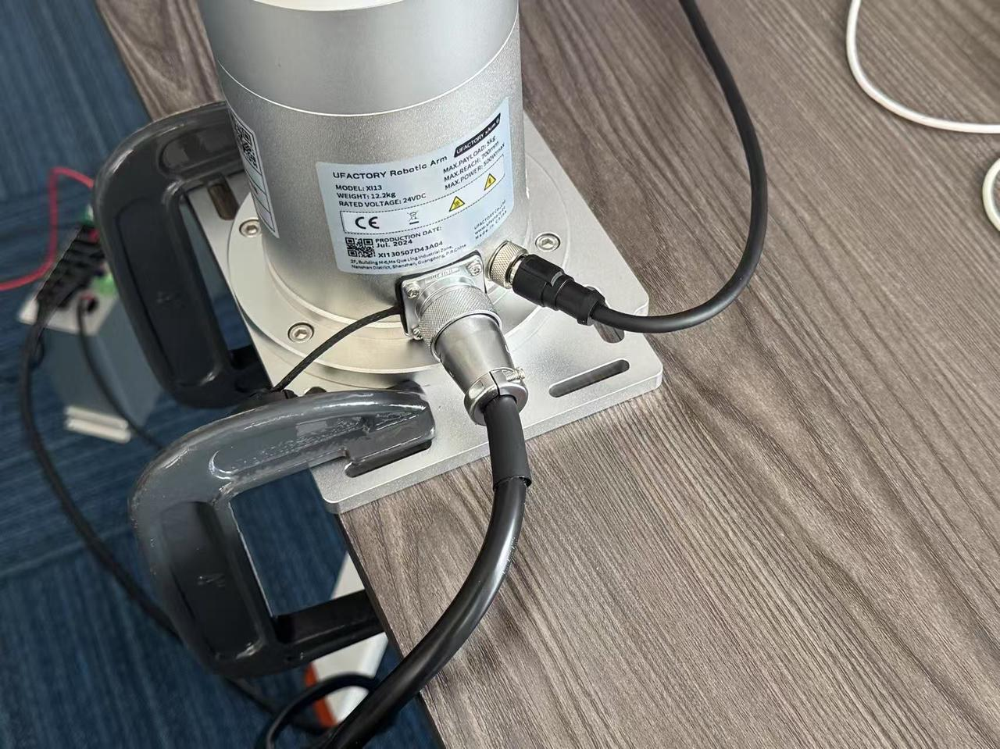

### 网线
此外，用网线连接控制器和电脑

### Network Connection
在控制箱上有机械臂的`ip地址`

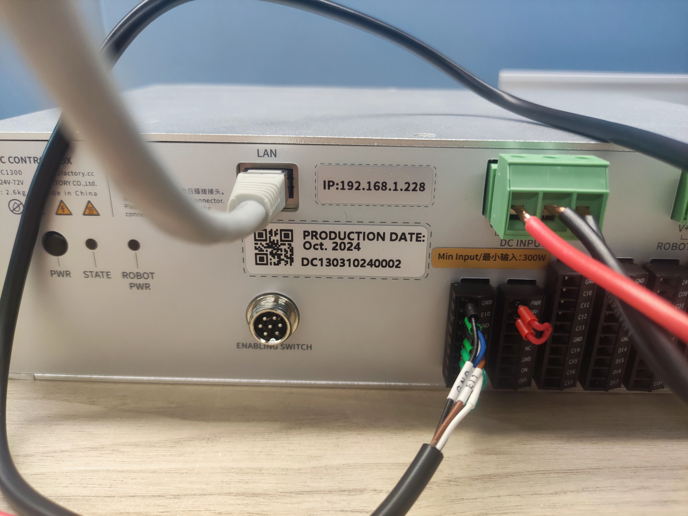

根据机械臂ip地址，将PC ip地址进行设置

name: `xarm`

IPv4: `192.168.1.220` (在`192.168.1.x`网段下即可, 设置的ip不要是0, 255和与机械臂ip相同) 

子网掩码: `255.255.255.0`

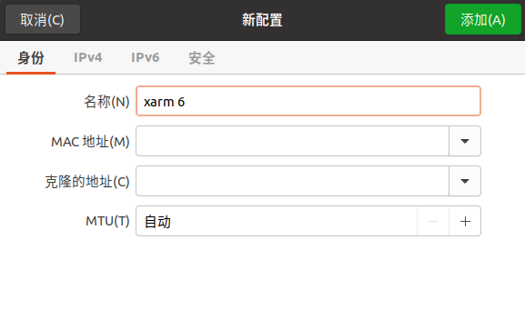
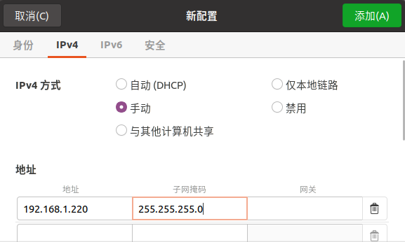
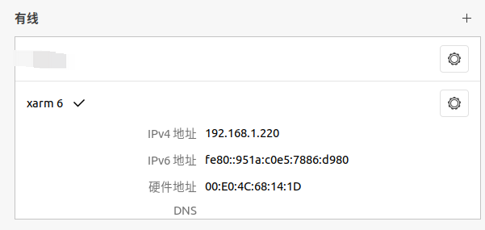

## Installation
&ensp;&ensp;you can run examples without installation. Only `Python 3` is supported.
### 1. download
```bash
git clone https://github.com/ChangerC77/xArm-Python-SDK.git
```

### 2. install
```bash
cd xArm-Python-SDK
python setup.py install
```

```bash
cd xArm-Python-SDK
pip install xarm-python-sdk
```
## Start
### 1. eef pose control
```
python xArm-Python-SDK/control/control_pose.py
```
### 2. joint position control
```
python xArm-Python-SDK/control/control_joint.py
```
### 3. get info
```
python xArm-Python-SDK/control/get_info.py
```
### 4. go to home position
```
python xArm-Python-SDK/control/home.py
```
### 5. teach mode
```
python xArm-Python-SDK/control/teach.py
```
### 6. teleoperation with spacemouse
about using spacemouse, see more details in https://github.com/ChangerC77/franka, Teleoperation setup
```
python xArm-Python-SDK/control/teleoperation.py
```
### 7. record data
```
python xArm-Python-SDK/control/record_trajectory.py
```
### 8. playback data
```
python xArm-Python-SDK/control/playback_trajectory.py
```
### 9. clear error
```
python xArm-Python-SDK/control/clearn_error.py
```
### 10. set tcp
```
python xArm-Python-SDK/control/set_tcp.py
```
### 11. mode & state definition
#### 1. position control mode
```
arm.set_mode(0)
arm.set_state(state=0)
```
#### 2. teach mode
```
arm.set_mode(7)
arm.set_state(0)
```
#### 3. continus mode
```
arm.set_mode(7)
arm.set_state(0)
```

## Doc
- #### [API Document](doc/api/xarm_api.md)

- #### [API Code Document](doc/api/xarm_api_code.md)

- #### [UFACTORY ModbusTCP Manual](doc/UF_ModbusTCP_Manual.md)
